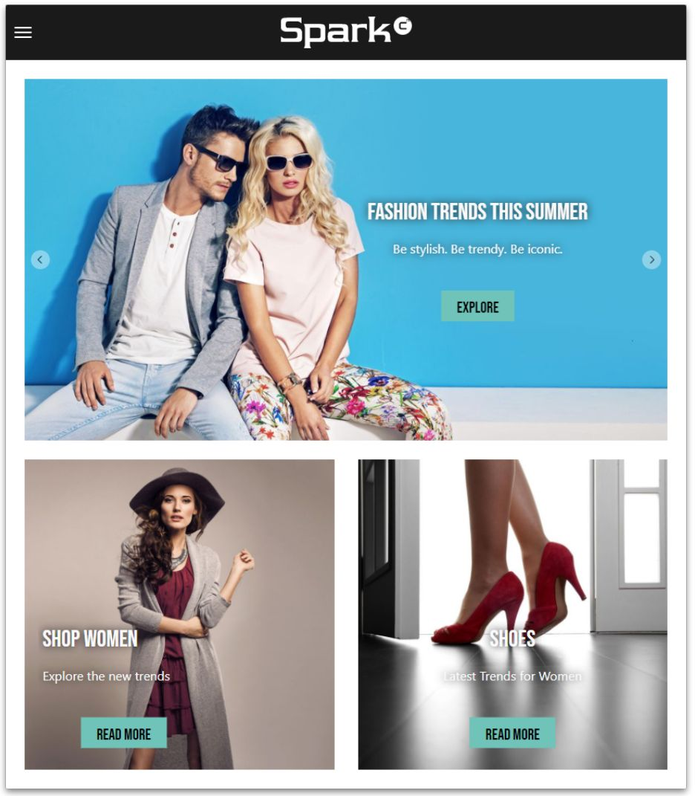

# Spark - The React Example Application



This is the workspace of Spark - a React example application based on React, 
TypeScript and the Headless Server of CoreMedia Content Cloud. It contains a 
GraphQL schema stitching server, and a commerce mocking server. The stitching 
server provides a unified GraphQL interface with an optional waiver of the 
otherwise necessary commerce connection (GraphQL Mocking Server).

CoreMedia customers can use Spark as a quick start for building prototype 
applications. Note that we do not recommend the use of these prototype apps in 
production environments.

This CoreMedia Labs project includes two React applications and two server 
components:

* _spark_ - Provides guidance for frontend developers that are building websites 
  and other applications based on the CoreMedia Headless server with code examples 
  and documentation on:
   * Preview Driven Editing
   * Time Travel
   * Placement Highlighting
   * Content Search
   * Fragment Preview and many others
* _standalone-fragment_ - Demonstrates the ability to load fragments from a 
  CoreMedia Content Cloud and render it on an external website. For example, by 
  injecting resources client side through a tag management solution like the 
  Google Tag Manager.
  
* _stitching-server_ - Provides a GraphQL Endpoint for the apps.
* _mocking-server_ - Provides generic commerce data for the stitching server.

Although we chose React with which to build Spark, the principles can easily be 
transferred to other component libraries and frameworks such as Vue and Angular.

This project will be updated with enhancements and fixes on a regular basis. 
Please refer to the [changelog](CHANGELOG.md) for more details.

## Quickstart

You need at least Node.js 20 (LTS), pnpm 9 and a running instance of the CoreMedia Content Cloud.
Define your environment variables in `.env` file for the stitching server:

[servers/stitching/.env](servers/stitching/.env.example)
```
COREMEDIA_ENDPOINT=https://<headless-server.example.com>/graphql
```

Install and build local environment once:
```
pnpm install
pnpm build
```

You can now start the workspace including the spark app in watch mode:
```
pnpm start
```

This will start both servers and the app concurrently. If you want to start just
one of the apps or servers, navigate to the according folder and run `pnpm start`.

## Documentation

Read the [documentation](docs/README.md) or on [GitHub Pages](https://coremedia.github.io/coremedia-headless-client-react/docs) for more information on development, deployment and the concepts of the app.


## Contributing

Read our [contributing guide](CONTRIBUTING.md) to learn about how to propose bugfixes and improvements.

## License

This project is licensed under the terms of the [CoreMedia Open Source License](LICENSE.txt).

The mocking server that is a fork of the project [smoke](https://github.com/sinedied/smoke) 
is licensed under the terms of the [MIT License](servers/mocking/LICENSE.txt).

## CoreMedia Labs

Welcome to [CoreMedia Labs](https://www.coremedia.com/labs)! This repository
is part of a platform for developers who want to have a look under the hood or
get some hands-on understanding of the vast and compelling capabilities of
CoreMedia. Whatever your experience level with CoreMedia is, we've got something
for you.

Each project in our Labs platform is an extra feature to be used with CoreMedia,
including extensions, tools and 3rd party integrations. We provide some test
data and explanatory videos for non-customers and for insiders there is
open-source code and instructions on integrating the feature into your
CoreMedia workspace. 

The code we provide is meant to be example code, illustrating a set of features
that could be used to enhance your CoreMedia experience. We'd love to hear your
feedback on use-cases and further developments! If you're having problems with
our code, please refer to our issues section. If you already have a solution to 
an issue, we love to review and integrate your pull requests. 

