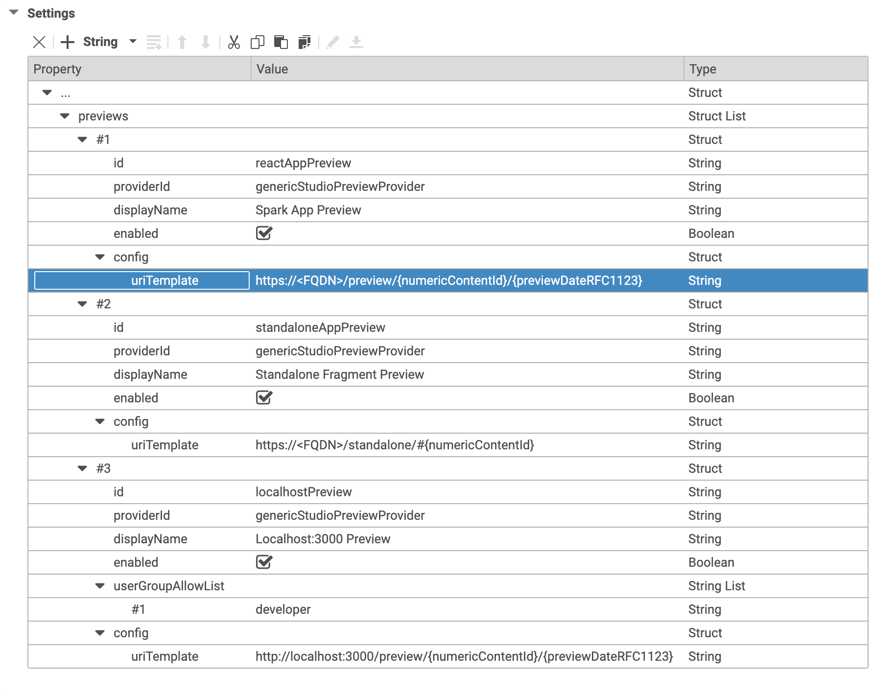

# CoreMedia Headless Client Documentation

[Documentation](../../README.md) / [Concepts](README.md) / Studio Preview Integration

---

# Studio Preview Integration

CoreMedia Studio automatically accesses and interprets content and property 
metadata in order to connect the preview and the content form. When the user edits a 
content property that is mapped to a preview DOM element via metadata, all changes 
are reflected in the embedded preview, either instantly (for simple content 
properties like strings) or through automatically reloading the preview.

You can enable the preview features in the app by setting the environment 
variable `VITE_PREVIEW=true`. It is enabled in the developer mode by default.

To enable the Spark App and the Standalone Fragment App in the Studio Preview for all 
Blueprints, add the configuration as depicted in the screenshot to the settings 
at `/Settings/Options/Settings/Multi Preview/Standard Preview` in the content
repository.

You can also add another entry for localhost for developers to integrate the 
local development server.



## Preview Driven Editing

Moving the mouse cursor over the preview will highlight elements with attached 
content and/or property metadata. Right-clicking one of these elements in the 
preview focuses the corresponding form field, if possible. If the clicked 
element belongs to a content object different from the content object currently 
displayed in the content form, a context menu is opened that shows a breadcrumb 
to navigate through the metadata hierarchy down to the clicked content object, 
and it offers the options to open the content in a new tab or in the library.

Add the following attribute to a component for a content or use the helper function
`metaDataElement(contentId)` from the [utils](../../../apps/spark/src/utils/Preview/MetaData.ts).

```
data-cm-metadata='[
    {"_":{"$Ref":"content/$ID"}}
]'
```

Add the following attribute to a component for a content property or use the helper function
`metaDataProperty(property)` from the [utils](../../../apps/spark/src/utils/Preview/MetaData.ts).


```
data-cm-metadata='[
  {"_":"properties.title"}
]'
```

## Time Dependent Visibility
  
The time at which a published content should be visible to the customer can be 
controlled by validity or visibility. The app in preview mode
will add this date to the Apollo Client for the server queries, see 
`createPreviewMiddleWare()` in [Apollo.ts](../../../apps/spark/src/utils/App/Apollo.ts).

For more information check the section "Time Dependent Visibility" in the 
[Headless Server Manual](https://documentation.coremedia.com/cmcc-10/artifacts/2010/webhelp/headlessserver-en/content/TimeTravel.html).

## Placement Highlighting

CoreMedia Studio's preview features a button to highlight placements of a _PageGrid_.
The button is only visible if the metadata contains information about the placement.

There are two types of placements:

- *Blue Box:*
If the placement is filled, you will find a blue border around it along with the placement name.
- *Green Box:*
If the placement is supported by the layout, but left empty, you will find a green box with the information that the placement is empty. The placement name is displayed as well.

Add the following code to the PageGridPlacement container or use the helper function
`metaDataForPlacement(placement)` from the [utils](../../../apps/spark/src/utils/Preview/MetaData.ts).

```
data-cm-metadata='[
  {"_":"properties.placement-$NAME"},
  {"placementRequest":[{"isInLayout":true, "hasItems":true, "placementName":"$NAME"}]}
]'
```

## Responsive Device Slider

CoreMedia Studio's preview features a device slider tool. With its help, the 
preview can display content on different simulated devices with varying sizes 
and resolution. I.e. a page can be viewed on a mobile device or tablet, 
landscape or portrait.

Add the following code to the `<body>` tag or change and use the helper function
`metaDataForResponsiveDevices(pageId)` from the [utils](../../../apps/spark/src/utils/Preview/MetaData.ts).

```
data-cm-metadata='[
    "cm_responsiveDevices":{
        "mobile_portrait":{"width":414,"height":736,"order":1,"isDefault":"true"},
        "mobile_landscape":{"width":736,"height":414,"order":2},
        "tablet_portrait":{"width":768,"height":1024,"order":3},
        "tablet_landscape":{"width":1024,"height":768,"order":4},
    },
    "cm_preferredWidth":414}
]'
```

## Fragmented Preview

The app has a route to a special [PreviewPage.tsx](../../../apps/spark/src/pages/PreviewPage.tsx),
if the app runs in preview mode. It renders a fragmented preview similar to the 
CAE for a given content ID. You can define a list of views for every content type in 
[FragmentsByType.ts](../../../apps/spark/src/components/FragmentPreview/FragmentsByType.ts).

